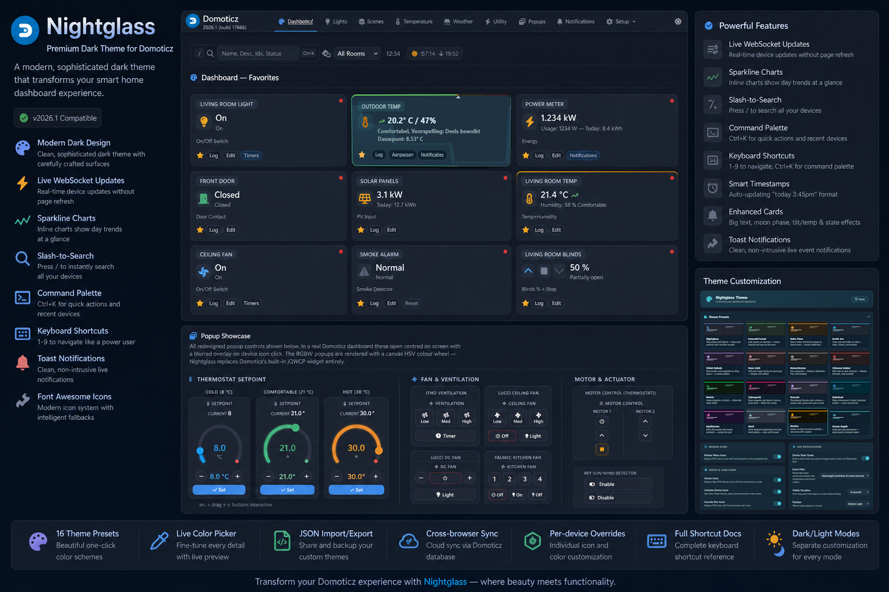

# Domoticz Nightglass Theme



A clean, modern dark theme for Domoticz dashboards with powerful keyboard shortcuts and real-time features.

**[Live Demo →](https://galadril.github.io/Domoticz-Nightglass-Theme/index.html)**

---

## ✨ Highlight Features

### 🎨 Visual Design & Customization
- **16 Built-in Theme Presets** - One-click themes including Nightglass (default), Emerald Forest, Solar Flare, Arctic Ice, Violet Nebula, Rose Gold, Monochrome, Crimson Ember, Matrix, Cyberpunk, Dracula, Solarized, Synthwave, Nord, Hacker, and Ocean Depth
- **Extensive Theme Customization** - Live color picker for accent, danger, warning, success, backgrounds, surfaces, borders, and text colors
- **Dual Mode Color Control** - Separate customization for dark and light modes
- **Per-Device Icon Overrides** - Assign any Font Awesome icon & custom on/off colors to individual devices
- **Import/Export Settings** - Save and share your custom themes as JSON files
- **Cloud Sync** - Settings automatically sync across all your browsers via Domoticz database
- **Professional Typography** - Clean text hierarchy with primary, secondary, and muted levels
- **Smooth Gradients & Shadows** - Subtle depth without glow/glassmorphism effects

### ⚡ Smart Features
- **Font Awesome Icon System** - Automatic PNG-to-FontAwesome 7 icon replacement with intelligent fallbacks
- **Live WebSocket Updates** - Real-time card updates without page refresh using Angular's device_update events
- **Sparkline Charts** - Inline SVG micro-charts showing day trends for sensors (temp, counter, rain, wind, etc.)
- **Command Palette** - Spotlight-style `Ctrl+K` interface for instant device control with fuzzy search and recent devices
- **Device Search** - Quick `/` search with fuzzy filtering and keyboard navigation
- **Keyboard Navigation** - Press `1-9` to jump between Dashboard, Switches, Scenes, Temp, Weather, Utility, Cameras, Log, Setup
- **Live Timestamps** - Auto-formatted "today 3:45pm" / "Jan 15, 2:30pm" timestamps that update in real-time
- **Enhanced Cards** - Big text mode, moon phase display, tilt/temp indicators, glow/flash effects for state changes
- **Modern UI** - Redesigned modals, popups, and toast notifications
- **Ace Editor Theming** - Themed code editor with persistent theme selection
- **Highcharts Integration** - Beautiful chart themes that match your color scheme

---

## ⌨️ Keyboard Shortcuts

### Quick Navigation (Number Keys)
Press **1-9** (when not typing) to instantly jump to sections:

| Key | Section |
|-----|---------|
| `1` | Dashboard |
| `2` | Switches |
| `3` | Scenes |
| `4` | Temperature |
| `5` | Weather |
| `6` | Utility |
| `7` | Cameras |
| `8` | Log |
| `9` | Setup |

### Device Search
- **`/`** → Open device search overlay
- **`↑` `↓`** → Navigate results
- **`Enter`** → Jump to device (smooth scroll + flash)
- **`Esc`** → Close search

### Command Palette (Power User Feature!)
Press **`Ctrl+K`** (or **`⌘K`** on Mac) from anywhere to open the command palette:

- **`Ctrl+K`** / **`⌘K`** → Open/close palette
- **`↑` `↓`** → Navigate devices
- **`Enter`** → Toggle device on/off (or expand dimmer slider)
- **`Shift+Enter`** → Navigate to device's page
- **`Esc`** → Close palette

#### Command Palette Features:
- **Fuzzy search** - Type partial names (e.g., "lvng lght" finds "Living Room Light")
- **Recent devices** - Shows your 24 most recently changed devices
- **Live state display** - Current on/off/level/temp status with color coding
- **Dimmer controls** - Inline slider for brightness adjustment (0-100%)
- **Instant feedback** - Icons and colors update immediately
- **Smart routing** - Automatically navigates to the correct page for each device type

**Example workflow:**
1. Press `Ctrl+K` anywhere
2. Type "bed" → find "Bedroom Light"  
3. Press `Enter` → toggle on/off
4. Type "liv" → find "Living Room Dimmer"
5. Press `Enter` → adjust brightness with slider
6. Press `Shift+Enter` → jump to device page
7. Press `3` → jump to Scenes
8. Press `/` → search devices on current page

It's **Spotlight/Alfred for your smart home!** 🚀

---

## 🎨 Theme Customization

Access the **Nightglass** settings tab in **Setup → Settings** to unlock extensive customization options:

### 🌈 16 Built-in Theme Presets
One-click themes with beautiful color palettes:

| Theme | Description |
|-------|-------------|
| **Nightglass** | Original dark theme — deep navy with cool blue accents |
| **Emerald Forest** | Lush greens on charcoal — nature-inspired |
| **Solar Flare** | Warm oranges and yellows — energetic sunrise |
| **Arctic Ice** | Cool blues and whites — crisp and clean |
| **Violet Nebula** | Purple and pink — cosmic elegance |
| **Rose Gold** | Sophisticated pinks and golds |
| **Monochrome** | Pure black and white — minimalist |
| **Crimson Ember** | Deep reds — bold and dramatic |
| **Matrix** | Classic green-on-black — hacker aesthetic |
| **Cyberpunk** | Neon pinks and blues — futuristic |
| **Dracula** | Popular purple theme — easy on the eyes |
| **Solarized** | Precision colors designed for readability |
| **Synthwave** | Retro 80s neon — nostalgic vibes |
| **Nord** | Arctic-inspired pastels — calm and minimal |
| **Hacker** | Terminal green — command-line inspired |
| **Ocean Depth** | Deep blues — underwater serenity |

### 🎨 Advanced Color Customization
Fine-tune every color with live preview:

- **Accent Colors** - Primary accent, danger, warning, success
- **Background & Surfaces** - Page background, navbar, cards, surfaces
- **Borders & Text** - Border colors and text hierarchy
- **Dual Mode Support** - Separate colors for dark and light modes

### ✨ Per-Device Icon Overrides
- Assign any Font Awesome 7 icon to individual devices
- Custom on/off colors per device
- Visual icon picker with search
- Perfect for personalizing your dashboard

### 💾 Import/Export & Sync
- **Export Settings** - Save your custom theme as a JSON file
- **Import Settings** - Load themes shared by the community
- **Cloud Sync** - Settings automatically sync across all browsers via Domoticz database
- **Local Storage Fallback** - Works even if API is unavailable

### 🔧 Other Settings
- **Sparkline toggle** - Enable/disable micro-charts on device cards
- **Big text mode** - Larger text for better readability
- **Show timestamps** - Display last update times on cards
- **Ace Editor theme** - Choose your preferred code editor theme

---

## 🚀 Installation

This theme is designed to sit alongside the default Domoticz theme.

### 1. Navigate to your Domoticz styles directory

```bash
cd <domoticz_dir>/www/styles/
```

### 2. Clone the theme into its own folder

```bash
git clone https://github.com/galadril/Domoticz-Nightglass-Theme.git nightglass
```

Or if you already cloned it earlier:

```bash
cd nightglass
git pull
```


### 3. Restart Domoticz
Restart Domoticz (only needed when your installing the theme for the first time)

```bash
sudo systemctl restart domoticz
```

### 4. Activate in Domoticz

-   Go to **Setup → Settings → Interface**
    
-   Set theme to **Nightglass**
    

> The Nightglass theme overrides the Default theme — no separate theme selection needed.

---

## 🧠 Notes

-   Font Awesome is already bundled with Domoticz (no setup required)

-   Easy to update via `git pull`

---

## ❤️ Contributing

Ideas, improvements, and feedback are always welcome.  
Feel free to open an issue or submit a PR on GitHub.

---

## 💝 Donation

If you like to say thanks, you could always buy me a cup of coffee (/beer)!   
(Thanks!)  
[](https://www.paypal.me/markheinis)

